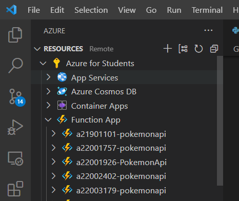
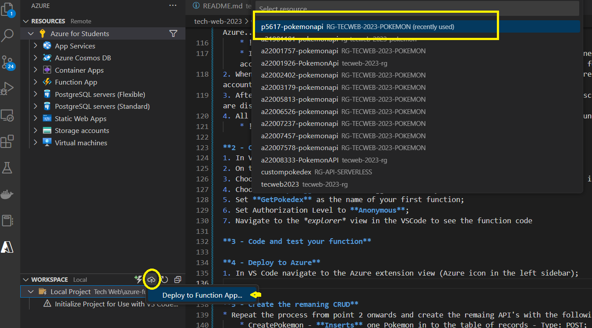
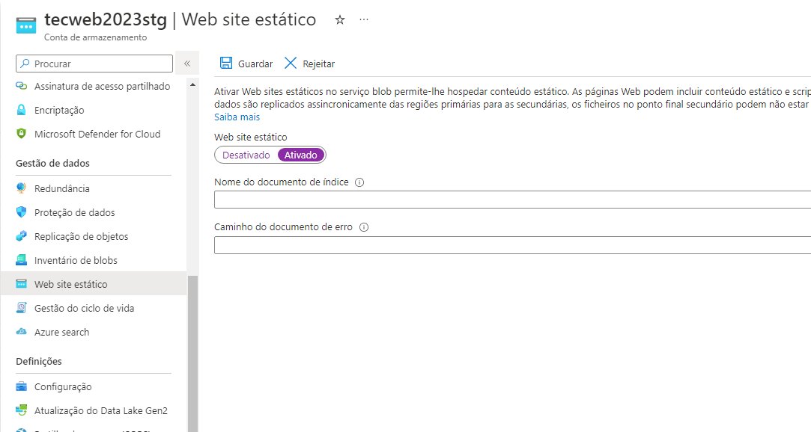
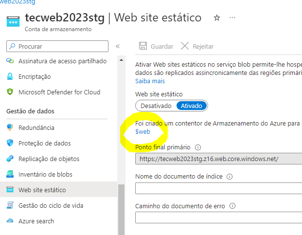
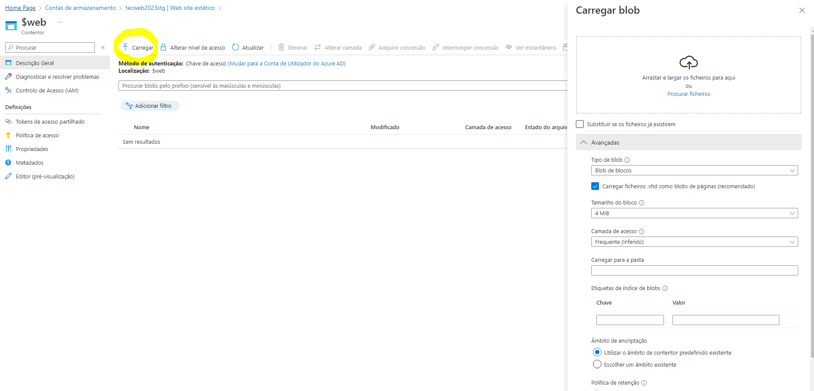
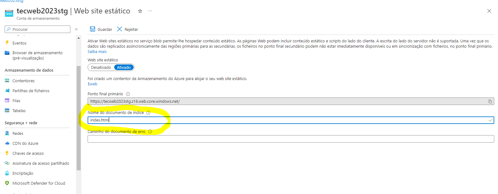

**TecWeb 2023 | Digital Future: da Universidade ao Mundo Empresarial**

# Who is CGI? 🤔
* Let's check who we are [here](../teoria/cgi-intro.pdf)

# Workshop ULHT - CGI | Cloud Native Development using Azure ☁️

**Abstract**📚: Technical training session focused on developing cloud-based applications using the Microsoft Azure platform. The workshop covers the best practices, technologies, and tools for cloud native development in Azure and helps participants gain a comprehensive understanding of how to build, deploy, and manage cloud-based applications on the Azure platform. 
In this workshop you will be able to build a back-end using **Python** and deployed it has a Azure Functions therefore following a Serverless architecture. For the front-end you will learn to build a **ReactJS** application and deployed to be scalable in Azure. The workshop will also cover topics such as serverless architectures, DevOps practices, and Azure deployment patterns.

**Workshop agenda** 📅
| Mon - 06/03 | Tue - 07/03 | Wen - 08/03 | Thu - 09/03 |
|-------------|-------------|-------------|-------------|
|10:00 - 12:30|10:00 - 12:30|10:00 - 12:30|10:00 - 12:30|

**Location**🗺️: CGI Innovation Lab (Incubadora PLAY- Campo Grande 376) & Classroom F.3.7.

**Technologies:** 💻
* **Cloud:** 
    * Microsoft Azure:
        * Azure Functions for API’s (Serverless);
        * Azure Blob Storage for the Front-end.
* **Front-end:** 
    * ReactJS;
* **Back-end:**
    * Python.

**PRE-REQUISITES** ✔️:
* **Workshop Registration** Please fill this [form](https://forms.gle/SqbcLbLPomcdubqZ8) with your University details in order to register in the workshop and so we can send you the invitation links for the Azure Portal/Subscriptions;
* **Azure for students account creation**: Create a [Azure for Students](https://azure.microsoft.com/en-us/free/students/) account;
* **Accept the invitation** sent by the instructors to join to workshop subscription and tenant;
* **Configure your environment**: Before you begin, make sure that you have the following requirements in place:
    * An Azure account with an active subscription. Create an account for free with the invitation link that you will receive from the instructors.
    * [NodeJS](https://nodejs.org/en/);
    * The [Azure Functions Core Tools](https://learn.microsoft.com/en-us/azure/azure-functions/functions-run-local#install-the-azure-functions-core-tools) version 4.x.
    * Python versions that are [supported by Azure Functions](https://learn.microsoft.com/en-us/azure/azure-functions/supported-languages#languages-by-runtime-version). Install [Python 3.10](https://www.python.org/downloads/release/python-31010//);
      * **Note**: During the installation make sure in the first step you select the checkbox that states "... add Python to PATH..."
    * [Visual Studio Code](https://code.visualstudio.com/download);
        * The [Python extension](https://marketplace.visualstudio.com/items?itemName=ms-python.python) for Visual Studio Code.
        * The [Azure Functions extension](https://marketplace.visualstudio.com/items?itemName=ms-azuretools.vscode-azurefunctions) for Visual Studio Code, version 1.8.3 or a later version.
    * [Git](https://git-scm.com/downloads).

# Let's start with some theory 🤓
* Let's first start with some [slides](../teoria/Eng.%20Software%20-%20Arquiteturas%20de%20Software.pdf)

# Tech Glossary 📖
|    Term     |
|-------------|
|**[Azure](https://learn.microsoft.com/en-us/training/azure/)**|
|[Azure Misc](https://learn.microsoft.com/en-us/azure/azure-glossary-cloud-terminology)|
|[Azure Functions](https://learn.microsoft.com/en-us/azure/azure-functions/functions-overview)|
|[Storage Account](https://learn.microsoft.com/en-us/azure/storage/common/storage-account-overview)|
|[Table Storage](https://learn.microsoft.com/en-us/azure/storage/tables/table-storage-overview)|
|[Blob Storage](https://learn.microsoft.com/en-us/azure/storage/blobs/storage-blobs-introduction)|
|[Application Insights](https://learn.microsoft.com/en-us/azure/azure-monitor/app/app-insights-overview?tabs=net)|
|[App Service plan](https://learn.microsoft.com/en-us/azure/app-service/overview-hosting-plans)|
||
|**[Pyhton](https://www.w3schools.com/python/)**|
||
|**[React](https://reactjs.org/docs/getting-started.html)**|
||
|**[npm](https://docs.npmjs.com/cli/v9/commands)**|


# Project 🛠️

**Goal**🎯: Create a Pokemon management application aka Pokedex. In this application the user should be allowed to managed Pokemons, their powers and other characteristics that you think would be good the save, use your imagination.
The main porpuse is to build a web based application using moderns technologies and best practices.


**Datamodel**:

|  Pokemon Entity    | Values and relevant information                                                                                                           |
|--------------------|-------------------------------------------------------------------------------------------------------------------------------------------|
| 'pokemonName' (pk) | str                                                                                                                                       |
| 'pokedexNumber'    | positive integer                                                                                                                          |
| 'pokemonType'      | (str) - 'normal','fire', 'water', 'grass', 'electric', 'ice', 'fighting', 'poison', 'flying', 'bug', 'psychic', 'ghost', 'dark', 'dragon' |
| 'pokemonColor'     | (str) - 'red', 'green' ,'blue', 'yellow', 'black', 'white', 'purple', 'orange', 'pink'                                                    |
| 'pokemonAttacks'   | [str]                                                                                                                                     |

* **Datamodel Rules**:
    * A Pokemon can have more than one PokemonAttack;
    * The 'pokemonName' is unique, we can't have two pokemons with the same name;
    * The 'pokedexNumber' is unique, we can't have two pokemons with the same number;
    * The 'pokemonColor' and 'pokemonType' are finite values (examples are given in table above).

**Business Rules**
* A web application, accessible from a web browser;
* Data should persist and not disappear when the application is restarted;
* Application accessible from anywhere in the world;
* It should be possible to create, read, update and delete a Pokemon and it's attacks.

**Architecture**


# Exercise | Part 1 | Create or first Function App ⚡

**What are Azure functions?**

Functions allow to run serverless code, code that you run only when you need it and that doesn’t need a whole infrastructure to live in. You can decide that a function is triggered when hitting an HTTP endpoint, or when new files are added into a blob storage for instance. It might always perform the same task, or it might do something different depending on your inputs. Basically, you can write code that does (almost) anything you can think of and host it as an Azure Function.

It’s really convenient and as a bonus, it’s cheap: you pay a fraction of a dollar for a million requests and the first million is free — that is unless you decide to go for the hosted plan (like a regular web app) and not the consumption plan.

For more information on Azure functions, [take a look at the documentation](https://learn.microsoft.com/en-us/azure/azure-functions/functions-overview).

**1 - Sign in to Azure**
Before you can publish your app, you must sign in to Azure.
1. If you aren't already signed in, choose the Azure icon in the Activity bar. Then in the Resources area, choose Sign in to Azure....
    * 
    * If you're already signed in and can see your existing subscriptions, go to the next section. If you don't yet have an Azure account, choose Create and Azure Account.... Students can choose Create and Azure for Students Account....
2. When prompted in the browser, choose your Azure account and sign in using your Azure account credentials. If you create a new account, you can sign in after your account is created.
3. After you've successfully signed in, you can close the new browser window. The subscriptions that belong to your Azure account are displayed in the sidebar.
4. All the resources that belong to your subscription will be shown on your side nav under the subscription tree list.
    * .

**2 - Create your first HTTP trigger function**
1. In VS Code navigate to the Azure extension view (Azure icon in the left sidebar);
2. On the **workspace** section, select *Create function*;
3. Choose **Python** as the programming language and afterwards select your local Python installation;
4. Choose **HttpTrigger** as the trigger mode for your function;
5. Set **GetPokedex** as the name of your first function;
6. Set Authorization Level to **Anonymous**;
7. Navigate to the *explorer* view in the VSCode to see the function code  

**3 - Code and test your function** 
* One-time configuration:
    1. Storage Account: 
        * In the Azure Portal navigate to your Storage Account;
        * Go to Tables and select *Table +*.
        * Set the table name to **Pokedex**;
        * To view the records in the database. In the same storage account navigate *Storage Browser > Tables > Pokedex*;
    2. Python dependencies:
        * Add the following dependencies separate by paragraphs to your *requirements.txt* file in the explorer view:
            * `azure-functions azure.data.tables schema`
            * **Glossary**
                * [azure-functions](https://learn.microsoft.com/en-us/azure/azure-functions/functions-reference-python?tabs=asgi%2Capplication-level&pivots=python-mode-configuration);
                * [Azure Data tables](https://learn.microsoft.com/en-us/python/api/overview/azure/data-tables-readme?view=azure-python);
                * [azure.core.exceptions](https://learn.microsoft.com/en-us/python/api/azure-core/azure.core.exceptions?view=azure-python);
                * [schema](https://pypi.org/project/schema/).
        * In VSCode go to Terminal > New Terminal;
        * Run the following command: `pip install -r requirements.txt`. (**Note**: Make sure your command line path is in the same directory as your *requirements.txt* file);
    3. Local Settings:
        * Open the file `local.settings.json`
        * Change `"AzureWebJobsStorage": ""` to `AzureWebJobsStorage": "DefaultEndpointsProtocol=..."` The value is defined in you Function App > Configuration > AzureWebJobsStorage > Copy the value string to the json file and save;

* Code your new function:
    1. In the *explorer* view of the VSCode open the folder with the name **GetPokedex**;
    2. Open `__init__.py` file;
    3. Start coding to the desired outcome, in this case to get all the Pokemons in Pokedex table. **Note**  - Please follow the Datamodel stated in the point above;
    4. To run and test locally press F5.

```
import logging
import os
import json

import azure.functions as func
from azure.data.tables import TableServiceClient


def main(req: func.HttpRequest) -> func.HttpResponse:

    table_service_client  = TableServiceClient.from_connection_string(conn_str= os.environ["AzureWebJobsStorage"])
    table_client = table_service_client.get_table_client(table_name="REPLACE WITH THE TABLE NAME")
    entities = table_client.list_entities()
    pokedex = "CREATE A NEW LIST IN PYTHON"
    //Create a loop and interate the entities variable list and append the results to the new pokedex list
       pokedex.append({
        'PokemonName': entity['PartitionKey'],
        'PokedexNumber': COMPLETE MISSING CODE
        'PokemonType': COMPLETE MISSING CODE
        COMPLETE MISSING CODE: entity['PartitionKey'],
        COMPLETE MISSING CODE: entity['PokemonAttacks'] if 'PokemonAttacks' in entity else []
       })

    return func.HttpResponse(json.dumps(pokedex))

```

**4 - Deploy to Azure**
1. In VS Code navigate to the Azure extension view (Azure icon in the left sidebar);
2. On the **workspace** section, select *Deploy > Deploy to Function App*;
3. On the dropdown selection **YOUR** function app (**Note**: This action will override all the data that is on your remote directory. Local rules the HEAD);
* .

**5 - Create the remaining CRUD's**
* Repeat the process from point 2 onwards and create the remaining API's with the following names:
    * CreatePokemon - **Inserts** one Pokemon into the table of records - Type: POST;
    * DeletePokemon - **Deletes** one Pokemon record by 'pokemonName' - Type: DELETE;
    * GetPokemonById - **Get** one Pokemon record by 'pokemonName' - Type: GET;
    * UpdatePokemon - **Updates** one Pokemon in the table of records - Type: POST.


# Exercise | Part 2 | Deploy your React Application into Azure Blob Storage 🐱‍💻

1. **Get the build files from your App**
* On your project just run the command “npm run build” and this will create a new folder called “build”. These are the static files that we will need to upload into Blob Storage.

2. **Configure your storage account**
* In the Azure portal navigate to your storage account and go to the tab "Static Website" select **"Enable"** and **don’t forget to save it.**. *This option is only avaliable for storage account StorageV2 (general purpose v2), so if you have a lower version please upgrage*
* .

3. **Upload the files**
* Click on **“$web”** and then “Upload”. You can now drag and drop all the files on the build folder previously created. In order to upload the folders, we need to go one by one. To do that just click on “Advance” and then on “Upload into folder” please insert the folder path as it is on the build folder. You have an example on the prints below for the folder “static\css”. Then drag and drop the files of that folder and save it.
* .
* .

4. **Select the root file**
* Just add the `index.html` file as the root file and save it. Hold on a minute and you are ready to go. You can try now open your App in the given URL (Primary Endpoint).
* .


